# Predicting Churn in a Ride Share Company

<a href="https://github.com/b-weintraub">Ben Weintraub</a> | <a href="https://github.com/redwin21">Eddie Ressegue</a> | <a href="https://github.com/mkpetterson">Maureen Petterson</a>

## Table of Contents

- <a href="https://github.com/mkpetterson/ride-share-churn#intro">Introduction</a>  
- <a href="https://github.com/mkpetterson/ride-share-churn#exploratory-data-analysis-and-data-preparation">Exploratory Data Analysis and Data Preparation</a> 
- <a href="https://github.com/mkpetterson/ride-share-churn#models-investigated">Models Investigated</a>  
- <a href="https://github.com/mkpetterson/ride-share-churn#comparison-of-models">Comparison of Models</a> 
- <a href="https://github.com/mkpetterson/ride-share-churn#summary-and-key-findings">Summary and Key Findings</a>

## Introduction
Ridership rates at ride sharing companies can be affected by several factors, some of which may include the cost of the rides, if the user rates the driver highly, and the ride experience. We were interested in finding out what methods can be used to help retain riders and what factors affect rider attrition. 

Our dataset contains the ridership information tracking 50,000 users, all of whom signed up in January 2014. Various factors, including number of rides, average trip length, surge percent, and driver/passenger ratings were tracked over a 6 month period (though July 1st, 2014). At the end of the period, a user would be considered "active" if she had used the rideshare company within the past 30 days. 

Churn was defined as no activity within the past 30 days, eg, no rides during the month of June. 

## Data Preparation and Exploratory Data Analysis

### Data Preparation

The dataset required cleaning prior to building and evaluating our models. In particular, there were 3 features with varying amounts of null values and several categorical features that needed to be transformed. 

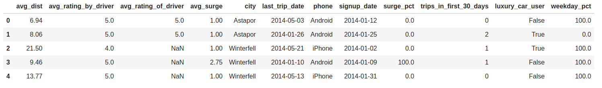

We made the following changes to both the train and test data:

- We filled in the missing values in 'average rating of driver' with the average rating from the other entries.  16% of the data in this column was missing and we felt this was too much data to drop from our analysis. 

- There were 201 nulls in the average rating of driver column. Similarly to the average rating by driver feature, we decided to fill in the nulls with the average value from other entries. 

- There were 396 nulls in the phone column, so we decided to drop those data points. 

- The city feature had three possible values (Winterfell, Astapor, and King's Landing) and we used one hot encoding to create three separate boolean features, one for each city. 

- We added a column for churn, with 1/True representing a customer who is not active in the past 30 days and 0 representing a customer who was active in the past 30 days. 

- We removed sign-up date, as these are all in January. We also removed last trip date as that data was no longer necessary. 

A screenshot of our cleaned dataset is below

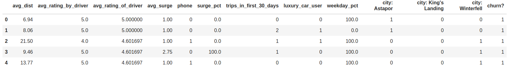

### Exploratory Data Analysis

Working on the training set only, we did some EDA to look at the distribution of the features. Below are several different plots highlighting correlations and distributions in the data. 

    
Correlation Heatmap

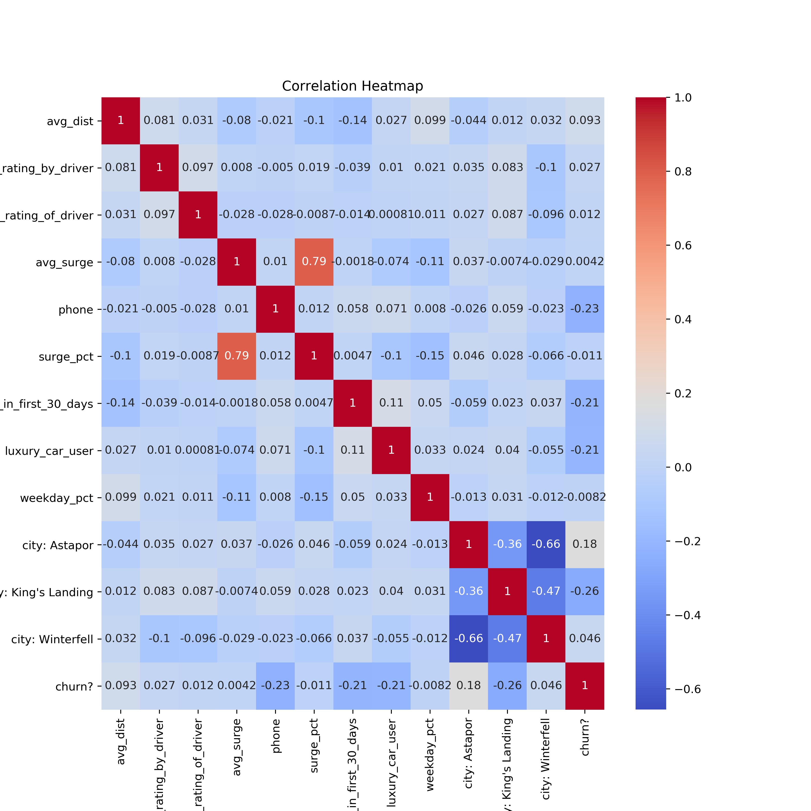

    
Histogram of Features

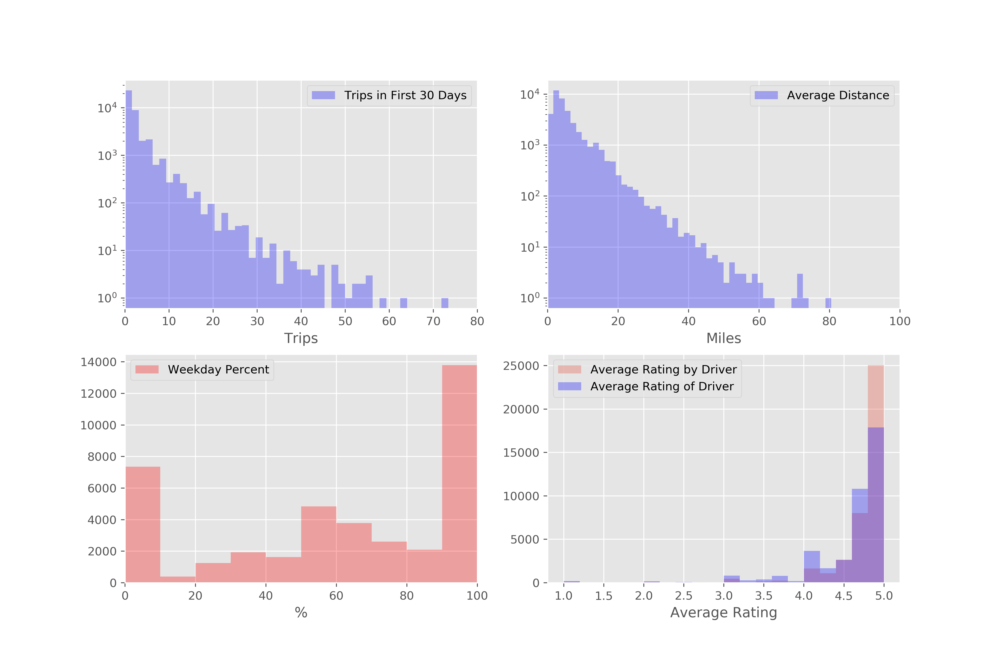

    
Binary Features Bar Chart

    <td>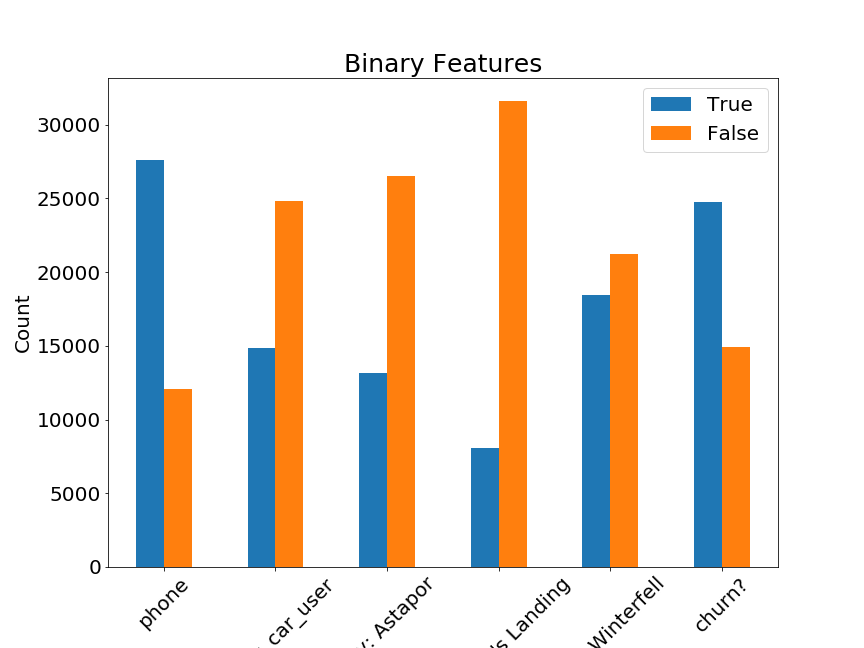</td>

## Models Investigated

We chose 3 different models to test: Neural Networks, Random Forest, and Gradient Boosting Classification. We decided to evaluate our models on the following metrics: Accuracy, Precision, Recall, and the ROC curve. Click below to display the details of each model. 

    
Neural Network Model

     
The idea behind the neural network model approach was to run a model with a large set of arbitrariliy engineered features. The original features were included in the model fit, as well as various operations on all non-binary feature types. These operations included:
- squaring
- cubing
- exponentiating
- taking the log
- inverting
- taking the sine and cosine
- multiplying all combinations of two features

This created a dataset with 110 total features. Because of this arbitrary feature engineering, feature importance was not investigated for this model.

Moderate tuning of the hyperparameters was done to achieve a final, satisfactory model. The input hyperparameters for the final neural network model include:
- 1000 epochs
- 3 hidden layers:
    - The first layer with ReLU activation
    - The second layer with TanH activation
    - The third layer with sigmoid activation to produce a probability
- 5000 batch size
- 0.2 validation split for cross validation
- 0.01 optimizer learning rate

    <td>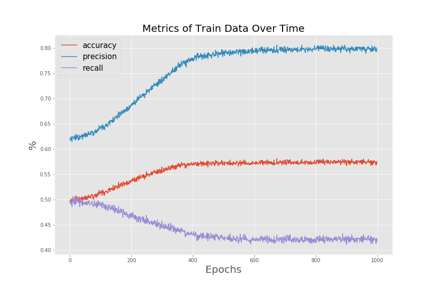</td>

A confusion matrix with a threshold of 50% can be seen here:

    <td>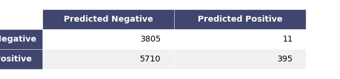</td>

    <b>Accuracy:</b> 57% | <b>Precision:</b> 80% | <b>Recall:</b> 43%

This matrix shows a large amount of false negatives, with a relatively small amount of false positives, so it is great at predicting positives but not negatives. This explains the high relative precision and low accuracy and recall.

    <td>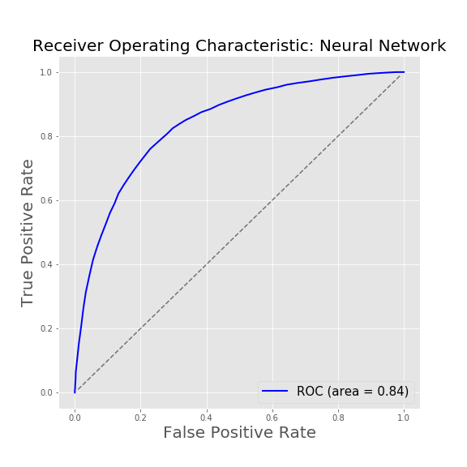</td>

The final model seems to make predictions in line with the Random Forest and Gradient Boosting models. However, the metrics here on the training data do not reflect similar values as the other models. The lack of interpretability of the neural network and the challenges in tuning the hyperparameters are among the reasons for not choosing to move forward with this model.

    
    
Random Forest Model

 
We used the following metrics to compare our models including accuracy, precision, recall, and confusion matrices.  Below are the definitions.

    <td></td>

    <b>Accuracy:</b>  74% | <b>Precision:</b> 80% | <b>Recall:</b> 77.7% 

The following were found to be the most important features:

    <td></td>

Next model hyperparameters were tuned to optimize the model. We optimized the numbers of trees, the max feature parameters, and the max_depth.  The results are shown below.

<ul>

</ul>

Here are the optimized parameters:

- n_estimators=40
- max_features=5
- max_depth=10

Here are the final optimized model metrics and ROC curve:

Confusion matrix :  

    <td></td>

    <b>Accuracy:</b>  78.2% | <b>Precision:</b> 80.5% | <b>Recall:</b> 85.8%

    <td></td>

    
Gradient Boosting Classifier

 
Gradient boosting is a powerful technique that combines an ensemble of weak learners (in this case, decision trees) to yield results better than a random forest classifier. This iterative technique performed faily well out of the box. The default values of our classifier are:
    
- n_estimators = 100
- learning rate = 0.1
- max depth = 3

The results can be summarized in the following confusion matrix with a threshold of 50%: 

 
 

    <td>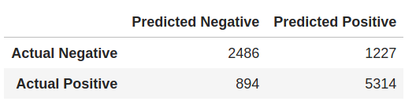</td>

    <b>Accuracy:</b> 79% | <b>Precision:</b> 81% | <b>Recall:</b> 86%

The Feature Importances are shown in the table below. 

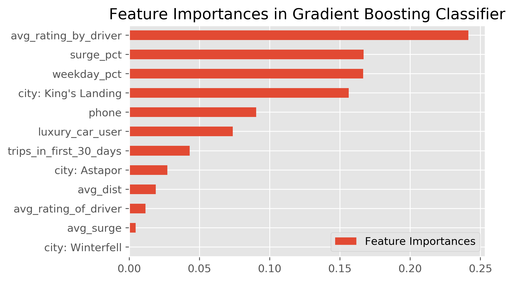

 
 

Optimizing Parameters: 

Looking at the training and testing errors as a function of number of trees leads to an optimized value of 830, although the change in test errors from 100 to 1000 is relatively minimal. The learning rate also affects the testing errors, but we found that the default learning rate of 0.1 actually works pretty well. 

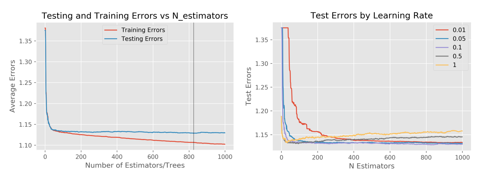

Running the "optimized" GBC model on our data results in the following ROC curve. 

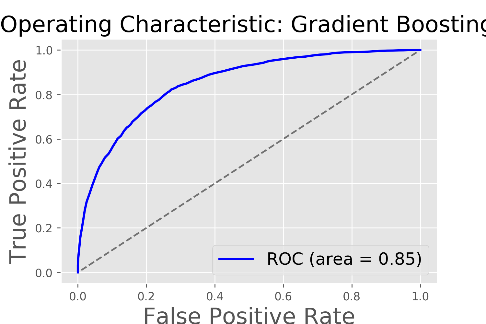

 

Summary of GBC: 

The Gradient Boosting Classifier works fairly well based on our scoring metrics; the area under the ROC curve is 0.85. We will need to compare this performance to that of the other models before selecting our optimal model for usage on the test data. 

The most influential features are: average rating by driver, surge percent, weekday percent, and living in King's Landing. Interestingly, these features were not highlighted in the correlation heatmap. 

    

## Comparison of Models

The ROC curves for each model were plotted on top of each other, showing that each model performs similarly to the others. Ultimately it was decided that the best model to select for testing was Gradient Boosting Classifier. The final results are shown below. 

    
ROC Curve and Confusion Matrix

    <td>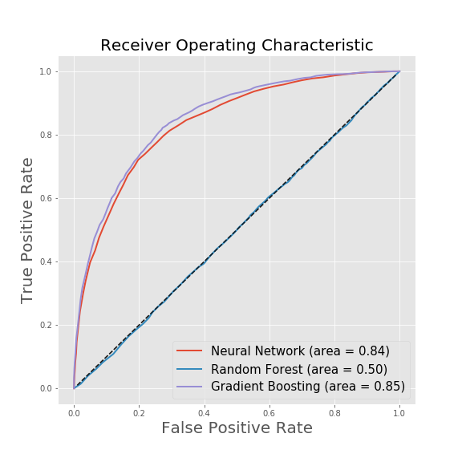</td>

 
 

    <td>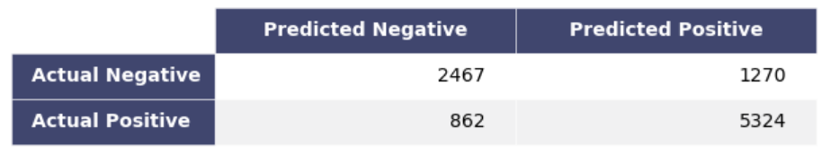</td>

    <b>Accuracy:</b> 78% | <b>Precision:</b> 81% | <b>Recall:</b> 86%

## Summary and Key Findings

While all the models performed well, we decided to use a Gradient Boosting Classifier to predict ridership churn. While the neural network performed well, it is essentially a black box that cannnot tell us the most important features and is less helpful in determining what business practices to change. 

Using the GBC model, the most important features predicting churn are average rating by driver, surge percent, weekday percent, and being in King's Landing. <b>Our final values for accuracy, precision, and recall are 78%, 81%, and 86%, respectively. </b>

### Recommendations

The average rating by driver (or the passenger rating) is not something that can be changed by the company. We suspect that passengers with poor ratings are not selected by drivers, and thus have a harder time getting rides. This leads to attrition, but perhaps it isn't bad for the company to lose the worst riders. 

A reduction in surge pricing or a reduction in surge hours would certainly help retain riders, as cost of the service can be a barrier. 

King's landing was also an important feature and people in King's Landing are less likely to churn than in Astapor: 37% vs 74%. Winterfell falls in between the two and has a churn rate of 65%. These differences could possibly be due to operational differences in the three cities and research should be conducted into why the churn rates vary.