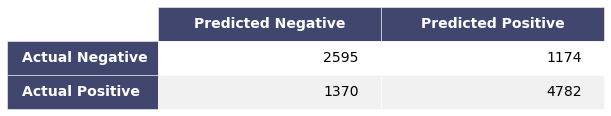
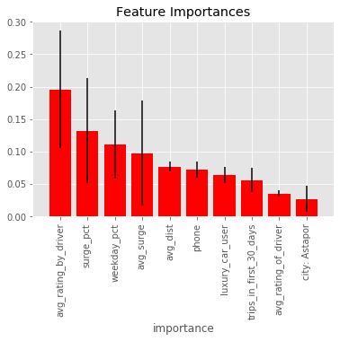
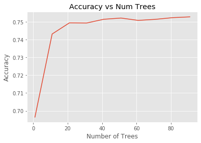
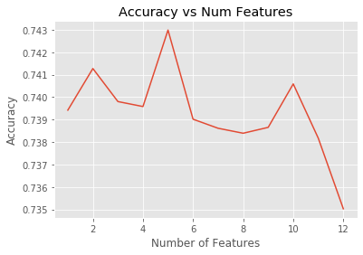
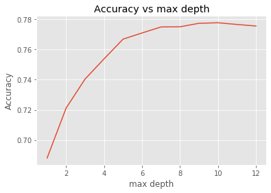
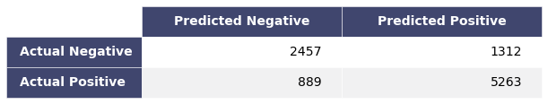
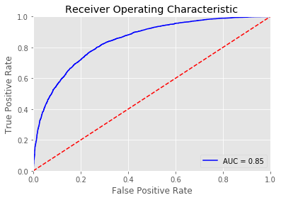

# Predicting Churn in Ride Share Company

Ben Weintraub, Eddie Ressegue, Maureen Petterson

## Intro
In an effort to retain ridership at a ride share company, we wanted to predict key factors affecting churn rate. Our dataset was pulled from July 1st, 2014 and contains data spanning the previous 5 months. The 12 features are:
- city
- sign-up date
- last trip date
- average distance
- average rating by driver
- average rating of driver
- surge percentage
- average surge
- trips in first 30 days
- luxury car user
- phone used for signup
- weekday percentage

Churn was defined as no activity within the past 30 days, eg, no rides during the month of June. 

## Exploratory Data Analysis and Data Preparation

<b>Data Preparation</b>

The dataset was alrady fairly clean, although there were 3 features with varying amounts of null values. 

Additionally, some of the features were categorical or contained information that was redundant. We made the following changes to both the train and test data:

- We filled in the missing values in 'average rating of driver' with the average rating from the other entries.  16% of the data in this column was missing and we felt this was too much data to drop from our analysis. 

- There were 201 nulls in the average rating of driver column. Similarly to the average rating by driver feature, we decided to fill in the nulls with the average value from other entries. 

- There were 396 nulls in the phone column, so we decided to drop those data points. 

- The city feature had three possible values (Winterfell, Astapor, and King's Landing) and we used one hot encoding to create three separate boolean features, one for each city. 

- We added a column for churn, with 1/True representing a customer who is not active in the past 30 days and 0 representing a customer who was active in the past 30 days. 

- We removed sign-up date, as these are all in January. We also removed last trip date as that data was no longer necessary. 

A screenshot of our cleaned dataset is below

<b>EDA</b>

Working on the training set only, we did some EDA to look at the distribution of the features. Below are a heatmap with correlation metrics, a histogram of numerical features, and a bar chart of the binary features. 

    <td></td>

## Models Investigated

We chose 3 different models to test: Neural Networks, Random Forest, and Gradient Boosting Classification. We decided to evaluate our models on the following metrics: Accuracy, Precision, Recall, and the ROC curve. 

<b> Neural Networks</b>

The idea behind the neural network model approach was to run a model with a large set of arbitrariliy engineered features. The original features were included in the model fit, as well as various operations on all non-binary feature types. These operations included:
- squaring
- cubing
- exponentiating
- taking the sine and cosine
- multiplying all combinations of two features

This creted a dataset with 97 total features. Because of this arbitrary feature engineering, feature importance was not investigated for this model.

The input hyperparameters for the final neural network model include:
- 1000 epochs
- 3 hidden layers:
    - The first layer with ReLU activation
    - The second layer with TanH activation
    - The third layer with sigmoid activation to produce a probability
- 5000 batch size
- 0.2 validation split for cross validation
- 0.01 optimizer learning rate

    <td></td>

Moderate tuning of the hyperparameters was done to achieve this final model.

    <td></td>

The ROC curve resides in the same range as the other models analyzed.

<b> Random Forest</b>

We used the following metrics to compare our models including accuracy, precision, recall, and confusion matrices.  Below are the definitions.

For the random forest classifier model with all the out-of-the-box default settings, the model had the following performance metrics:

Confusion matrix :  
 
  

 

<b>Accuracy:</b>  74% | <b>Precision:</b> 80% | <b>Recall:</b> 77.7% 

 
 

In the random forest model the following were found to be the most important features.  It can be seen that the top 3 included avg_dist, weekday_pct, and avg_rating_by_driver.

  

  

#### Next model hyperparameters were tuned to optimize the model

We optimized the numbers of trees, the max feature parameters, and the max_depth.  The results are shown below.

<ul>

</ul>

   

Here are the optimized parameters:

| n_estimators       | max_features | max_depth  |
| ------------- |:-------------:| -----:|
| 40    | 5 | 10 |

Here are the final optimized model metrics and ROC curve:

Confusion matrix :  
 
  

 

<b>Accuracy:</b>  78.2% | <b>Precision:</b> 80.5% | <b>Recall:</b> 85.8% 
 
 

 
 

    
<b> Gradient Boosting Classifier</b>
Out of the box metrics for Gradient Boosting Classfier were pretty good. The default values are n_estimators = 100, learning rate = 0.1, and max depth = 3.
Accuracy: 79%
Precision: 86%
Recall: 81%

Feature Importances:

Looking at the training and testing errors as a function of number of trees leads to an optimized value of 137, which is pretty close to the default value. 

You can see that the learning rate affects the testing errors. The default learning rate of 0.1 actually works pretty well. 

The initial parameters of the GBC seem to be close to optimal. Running this model on the test data reveals slightly lower numbers. 
Accuracy: 78%
Precision: 86%
Recall: 80% 
MSE: 0.218
There doesn't seem to be any features that indicate leakage, although the features of average surge and surge percentage are highly correlated. 

## Key Findings

The most influential features are: average rating by driver, surge percent, weekday percent, and living in King's Landing. All models show a very similar ROC curve.

## Work Flow

1. Perform any cleaning, exploratory analysis, and/or visualizations to use the
provided data for this analysis.
   
2. Build a predictive model to help determine the probability that a rider will
be retained.

3. Evaluate the model.  Focus on metrics that are important for your *statistical
model*.
 

5. Discuss the validity of your model. Issues such as
leakage.  For more on leakage, see [this essay on
Kaggle](https://www.kaggle.com/dansbecker/data-leakage), and this paper: [Leakage in Data
Mining: Formulation, Detection, and Avoidance](http://citeseerx.ist.psu.edu/viewdoc/download?doi=10.1.1.365.7769&rep=rep1&type=pdf).

6. Repeat 2 - 5 until you have a satisfactory model.

7. Consider business decisions that your model may indicate are appropriate.
Evaluate possible decisions with metrics that are appropriate for *decision
rules*.
   